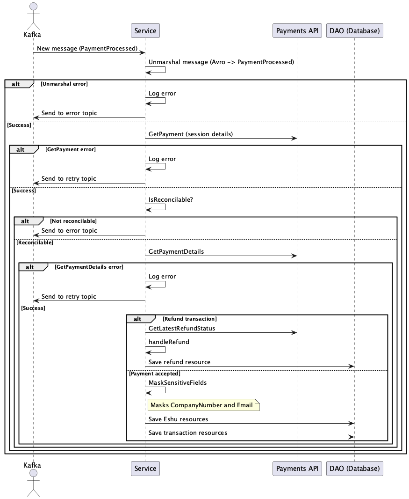

# Payment Reconciliation Consumer - Detailed Design Document

## Overview
The Payment Reconciliation Consumer is designed to process payment-related messages from a Kafka topic. It ensures that payment events are reconciled and stored in the database while adhering to security and business rules. This document provides a detailed design of the service, focusing on its architecture, components, and business logic.

---

## Architecture

### Key Components
1. **Kafka Consumer**:
   - Listens to a configured topic for `paymentreconciliation` messages using Spring Kafka.
   - Supports retry and error topics for resilience.

2. **Kafka Producer**:
   - Used for publishing messages to retry or error topics in case of failures.

3. **Payments API Integration**:
   - Fetches payment session details and payment-specific data using Spring's `RestTemplate` or `WebClient`.

4. **DAO Layer**:
   - Handles database operations for storing payment transactions and refund data using Spring Data JPA.

5. **Transformer**:
   - Converts API and message data into database models.

6. **Resilience/Retry Handler**:
   - Manages transient errors and retries using Spring Retry.

7. **Masking Logic**:
   - Ensures sensitive fields are masked before further processing.

---

## Sequence Diagram

The following sequence diagram illustrates the message processing flow:

---

## Message Processing Flow

### 1. Message Consumption
- The service consumes messages from the Kafka topic using Spring Kafka's `@KafkaListener` annotation.
- Messages are processed in a loop until a shutdown signal is received or the stop offset is reached.

### 3. Deserialize Message
- The message is deserialized from Avro format into a `paymentreconciliation` Java object using a schema registry.
- **Error Handling**: If deserialization fails, the error is logged, and the message is sent to the error topic.

### 4. Fetch Payment Session
- The service calls the Payments API to retrieve payment session details using the `ResourceURI` from the message.
- **Error Handling**: If the API call fails:
  - The service checks if the resource is "gone" and skips the message if configured.
  - Otherwise, the error is logged, and the message is sent to the retry topic.

### 5. Check Reconcilable
- The `isReconcilable` method determines if the payment can be reconciled based on business rules.
- **Non-Reconcilable Payments**: The message is committed, and processing continues.

### 6. Fetch Payment Details
- If the payment is reconcilable, the service fetches detailed payment information from the Payments API.
- **Error Handling**: Similar to the payment session fetch.

### 7. Process Transaction
#### Refund Transactions:
- The service fetches the latest refund status.
- If the refund is successful, it is reconciled and saved to the database.
- **Error Handling**: Errors are logged, and the message is sent to the retry topic.

#### Accepted Payments:
- Sensitive fields (`CompanyNumber`, `Email`) are masked.
- Payment transactions are extracted and saved to the database.

### 8. Shutdown
- The service gracefully shuts down, ensuring all resources (e.g., Kafka consumer/producer) are closed.

---

## Business Logic

### Masking Sensitive Fields
- **Fields Masked**:
  - `CompanyNumber`
  - `CreatedBy.Email`
- **Condition**:
  - Masking is applied only if the `ProductCode` is `16800`.
- **Purpose**:
  - To ensure sensitive data is not exposed during processing or storage.

### Error Handling
- **Deserialization Errors**:
  - Logged and sent to the error topic.
- **API Call Failures**:
  - If the resource is "gone", the message is skipped based on configuration.
  - Other errors are logged and sent to the retry topic.
- **RetryableException**:
  - Includes HTTP responses (excluding 400 & 409) and deserialization errors like `InvalidPayloadException`.
- **NonRetryableException**:
  - Includes 400 and 409 HTTP responses, and URI validation exceptions.

### Database Persistence
- **Payment Transactions**:
  - Converted into database models and persisted using Spring Data JPA.
- **Refunds**:
  - Reconciled and saved if the refund status is successful.

---

## Configuration

### Kafka Topics
- **Standard Topic**: For normal message processing.
- **Retry Topic**: For transient errors.
- **Error Topic**: For unrecoverable errors.

### Environment Variables
| Variable                                    | Description                                                                          | Example                               |
|---------------------------------------------|--------------------------------------------------------------------------------------|---------------------------------------|
| PAYMENT_API                                 | The client ID of an API key, with internal app privileges, to call payments-api with | abc123def456ghi789                    |
| BOOTSTRAP_SERVER_URL                        | The URL to the kafka broker                                                          | kafka:9092                            |
| CONCURRENT_LISTENER_INSTANCES               | The number of listeners run in parallel for the consumer                             | 1                                     |
| PAYMENT_PROCESSED_TOPIC                     | The topic ID for refund request topic                                                | payment-processed.                    |
| PAYMENT_RECONCILIATION_GROUP_NAME           | The group ID for the service's Kafka topics                                          | reconciliation-group.                 |
| MAX_ATTEMPTS                                | The number of times a message will be retried before being moved to the error topic  | 2                                     |
| BACKOFF_DELAY                               | The incremental time delay between message retries                                   | 60 (seconds)                          |
| LOGLEVEL                                    | The level of log messages output to the logs                                         | debug                                 |
| PORT                                        | The port at which the service is hosted in ECS                                       | 8080                                  |
| MONGODB_URL                                 | MongoDB server URL                                                                   | mongodb://mongo:27017                 |
| MONGODB_DATABASE                            | MongoDB database for data                                                            | payment_reconciliation